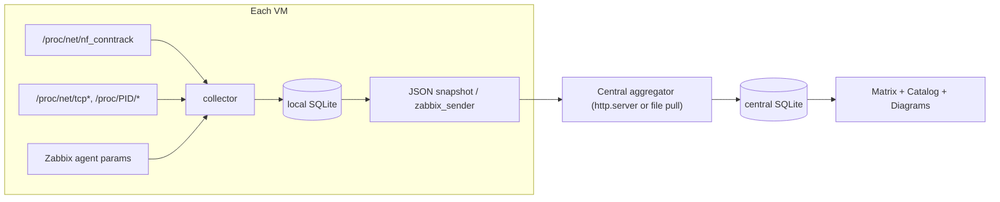

# Commatrix

Commatrix is a **standard-library-only** Python tool for Linux servers (typically
running a Zabbix agent) that maps network communication using `nf_conntrack`
instead of packet capture (`tcpdump`/libpcap). It collects flow data on many
VMs, attributes each flow to the **application/process** that produced it,
enriches it with **Zabbix host parameters**, and aggregates everything into a
**communication matrix** and an **application catalog** with ready-to-use
documentation exports.

## Why nf_conntrack?

The kernel already tracks connections. Reading `/proc/net/nf_conntrack` gives us
source, destination, port, protocol and (with accounting enabled) byte/packet
counters without any capture library or elevated packet-sniffing. Commatrix
polls this table, folds ephemeral client ports into stable *service edges*, and
maintains, per edge:

- source, destination, service port, protocol, direction
- cumulative bytes / packets (best-effort estimate from snapshot deltas)
- `first_seen`, `last_seen`
- `max_gap` — the **longest idle interval between two communications**

### Required kernel settings

Byte/packet accounting and flow timestamps are off on many distros. Enable them
(the systemd unit does this automatically):

```bash
sysctl -w net.netfilter.nf_conntrack_acct=1
sysctl -w net.netfilter.nf_conntrack_timestamp=1
```

Reading `/proc/net/nf_conntrack` and `/proc/<pid>/fd` requires **root**.

## Requirements

- Linux with the `nf_conntrack` module loaded (RHEL 8+, Ubuntu 20.04+ base images).
- Python 3.9+ (standard library only — no pip dependencies).
- No extra packages required. When `/proc/net/nf_conntrack` is absent commatrix
  automatically uses the **`sock_diag` netlink** interface (the same source as
  `ss -i`) to get *real per-socket TCP byte/packet counts with no install and
  no root*; if even that is unavailable it falls back to `/proc/net/{tcp,udp}`
  (topology only, zero bytes). Optional: `conntrack-tools` if already shipped by
  the distro, or a Zabbix agent (`zabbix_get`/`zabbix_sender`) for host params.

## Install

### Recommended: the installer (systemd + resource limits)

```bash
sudo ./install.sh                 # system-wide; installs & starts the systemd service
sudo ./install.sh --no-start      # install without starting
./install.sh --user               # per-user install (labs/testing; capture still needs root)
sudo ./install.sh --uninstall     # remove (keeps config/data)
```

The installer copies the package, writes `/etc/commatrix/commatrix.conf`, enables
the required conntrack sysctls, installs the systemd unit **with a CPU quota of
10% of total compute** (`10% x nproc`) and a memory ceiling, installs the Zabbix
`UserParameter` file if an agent is present, and enables the service. Override
budgets with `--cpu-percent N` / `--disk-percent N`.

### One-shot: install as root, control as a user

If you want the collector installed once as a **system** service (root) but be
able to start/stop/inspect it as your normal user **without a root password**:

```bash
sudo ./packaging/install-service.sh            # controlling user defaults to $SUDO_USER
sudo ./packaging/install-service.sh --user alice
sudo ./packaging/install-service.sh --uninstall
```

It runs the system installer, then delegates control of **only** the
`commatrix-collector.service` unit to that user via a scoped `sudoers` drop-in
(and a polkit rule when polkit is present), and installs a `commatrix-ctl`
wrapper:

```bash
commatrix-ctl status
commatrix-ctl start | stop | restart
commatrix-ctl logs | follow
```

### Manual / pip

```bash
pip install .        # provides the `commatrix` command; also runnable as `python3 -m commatrix`
```

## Resource safety (never hurt the host)

Commatrix is designed to be invisible to real workloads:

- **CPU:** an in-process governor measures how much CPU each poll consumed and
  sleeps so the collector never averages more than **10% of total compute**
  (all cores). It also backs off further under high load average. The systemd
  unit additionally enforces `CPUQuota`, `Nice=19`, `CPUSchedulingPolicy=idle`
  and `IOSchedulingClass=idle` as a hard ceiling.
- **Disk:** the database never exceeds **10% of free disk space** (least-recently
  active edges are pruned, plus a `retention_days` window). Writes pause entirely
  if free space falls below a hard floor (default 5%).
- **Memory:** advisory `memory_max_mb` in the config, enforced by the unit's
  `MemoryMax`.

All limits are configurable in the `[resources]` section of the config.

## Test Zabbix agent installer (lab only)

To spin up a Zabbix agent for exercising the integration on a lab machine:

```bash
sudo ./packaging/install-zabbix-agent-test.sh \
    --hostname lab-pc --server 127.0.0.1 --with-commatrix-userparams
```

This installs the distro `zabbix-agent`, points it at the given server, sets the
hostname, and (optionally) installs the commatrix UserParameters. It is **not**
hardened for production.

### Lab sudo helper (passwordless root for collection)

For lab machines (RHEL 8+, Ubuntu 20.04+), install passwordless sudo once
interactively, then run collection without prompts. No packages or network access
are required by these scripts.

```bash
cd /path/to/appmap

# 1) One-time: installs /etc/sudoers.d/commatrix-lab (prompts for YOUR password once)
chmod +x packaging/install-lab-sudoers.sh packaging/lab-commatrix-helper.sh
./packaging/install-lab-sudoers.sh

# 2) Enable conntrack accounting / detect capture backend (no password after step 1)
sudo ./packaging/lab-commatrix-helper.sh setup-conntrack

# 3) Collect (writes DB + HTML report; sysctls restored automatically after run)
sudo ./packaging/lab-commatrix-helper.sh collect-once --database /tmp/commatrix.db
sudo ./packaging/lab-commatrix-helper.sh collect --database /tmp/commatrix.db --iterations 120

# Environment changes (sysctls) are logged to ./commatrix-lab-env.log in the repo root.

# Remove passwordless sudo when done
./packaging/install-lab-sudoers.sh --remove
```

After collection, open `/tmp/commatrix-report.html` for the dashboard with graphs.

## Usage

### 1. Collect on each VM (daemon)

```bash
sudo commatrix collect --config /etc/commatrix/commatrix.conf
# one-shot for testing:
sudo commatrix collect --once --database /tmp/commatrix.db
```

### 2. Centralise across VMs

Two supported transports (pick one, both ship):

**File pull (default):** each host exports a snapshot; a central node merges.

```bash
# on each host (systemd timer does this):
commatrix export -o /var/lib/commatrix/snapshots/$(hostname).json
# on the central node, after rsync/scp of the snapshots:
commatrix aggregate --central /var/lib/commatrix/central.db \
    --snapshot-dir /var/lib/commatrix/snapshots
```

**Push to a central server:**

```bash
# central node:
commatrix serve --database /var/lib/commatrix/central.db --port 8899 --token SECRET
# each host:
commatrix push --server http://central:8899 --token SECRET
```

### 3. Report / document

```bash
commatrix report -f markdown  --database central.db   # communication matrix
commatrix report -f html      --database central.db   # HTML dashboard + graphs
commatrix report -f csv       --database central.db
commatrix report -f mermaid   --database central.db   # topology diagram
commatrix report -f dot       --database central.db | dot -Tpng -o topology.png
commatrix report -f sheets    --database central.db   # per-application docs
commatrix report -f catalog   --database central.db   # machine-readable JSON
commatrix report -f security  --database central.db   # exposure highlights
```

### 4. Drift detection

```bash
commatrix diff baseline.json current.json    # added/removed communications
```

## Zabbix integration

- **Host parameters:** Commatrix reads `zabbix_agentd.conf` for the canonical
  `Hostname`/`HostMetadata`, and queries the local agent via `zabbix_get` for
  system facts (falling back to procfs/`platform` when unavailable). See
  `commatrix hostparams`.
- **UserParameters:** `packaging/zabbix_userparameter.conf` exposes summary
  metrics (edge counts, external exposure, freshness) so Zabbix can pull health.
- **Transport:** an optional `zabbix_sender` exporter is available for pushing
  summary items to a trapper.

## Application catalog

Beyond raw flows, Commatrix enriches the catalog with:

- process/service/unit/package/container attribution per port,
- logical application naming and layer-7 protocol inference via
  `commatrix/signatures/*.json` (editable),
- internal vs external peer classification and optional reverse DNS,
- inter-VM linking (peer IPs matched back to known hosts),
- drift detection (baseline vs current),
- security highlights (external inbound exposure, cleartext protocols),
- documentation outputs (matrix, topology diagram, per-app service sheets, CMDB-ready JSON).

## Architecture



## Limitations

- `nf_conntrack` is a snapshot; very short flows between polls can be missed
  (use the `conntrack-events` source or a lower `poll_interval` to reduce this).
- Byte counts are a best-effort cumulative estimate, not exact accounting, and
  require `nf_conntrack_acct=1`.
- Runs **unprivileged by default**: topology is always captured, but toggling
  the `nf_conntrack` sysctls and attributing *other users'* processes need
  `CAP_NET_ADMIN` / `CAP_DAC_READ_SEARCH` (the systemd unit grants exactly
  these) or root (`install.sh --as-root`, or `require_root`/`--require-root`).

## Incident-response history

Every collect run also writes an **append-only event log** (`flow_events`):
one row when an edge is first seen (`new`) and one when it becomes active again
after being idle (`reactivated`, threshold `event_min_gap_seconds`). This gives
a forensic timeline of "when did host X first talk to Y":

```bash
commatrix history --database /var/lib/commatrix/commatrix.db            # markdown
commatrix history -f jsonl --since-seconds 3600 --kind new              # for SIEM
```

The database and exported snapshots are created `0640` (dir `0750`) so the
network map is not world-readable.

## License

GPL-3.0-or-later. See [LICENSE](LICENSE).
