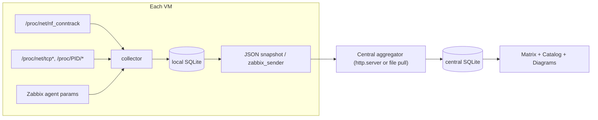

# Commatrix

Commatrix is a **standard-library-only** Python tool for Linux servers (typically
running a Zabbix agent) that maps network communication using `nf_conntrack`
instead of packet capture (`tcpdump`/libpcap). It collects flow data on many
VMs, attributes each flow to the **application/process** that produced it,
enriches it with **Zabbix host parameters**, and aggregates everything into a
**communication matrix** and an **application catalog** with ready-to-use
documentation exports.

## Why nf_conntrack?

The kernel already tracks connections. Reading `/proc/net/nf_conntrack` gives us
source, destination, port, protocol and (with accounting enabled) byte/packet
counters without any capture library or elevated packet-sniffing. Commatrix
polls this table, folds ephemeral client ports into stable *service edges*, and
maintains, per edge:

- source, destination, service port, protocol, direction
- cumulative bytes / packets (best-effort estimate from snapshot deltas)
- `first_seen`, `last_seen`
- `max_gap` — the **longest idle interval between two communications**

### Required kernel settings

Byte/packet accounting and flow timestamps are off on many distros. Enable them
(the systemd unit does this automatically):

```bash
sysctl -w net.netfilter.nf_conntrack_acct=1
sysctl -w net.netfilter.nf_conntrack_timestamp=1
```

Reading `/proc/net/nf_conntrack` and `/proc/<pid>/fd` requires **root**.

## Requirements

- Linux with the `nf_conntrack` module loaded.
- Python 3.9+ (standard library only — no pip dependencies).
- Optional: `conntrack-tools` (for the event source), a Zabbix agent
  (`zabbix_get`/`zabbix_sender`) for host parameters and transport.

## Install

```bash
pip install .        # or: python3 -m pip install .
# provides the `commatrix` console command; you can also run `python3 -m commatrix`
```

Copy the example config and packaging assets:

```bash
install -Dm644 packaging/commatrix.conf.example /etc/commatrix/commatrix.conf
install -Dm644 systemd/commatrix-collector.service /etc/systemd/system/commatrix-collector.service
systemctl enable --now commatrix-collector.service
```

## Usage

### 1. Collect on each VM (daemon)

```bash
sudo commatrix collect --config /etc/commatrix/commatrix.conf
# one-shot for testing:
sudo commatrix collect --once --database /tmp/commatrix.db
```

### 2. Centralise across VMs

Two supported transports (pick one, both ship):

**File pull (default):** each host exports a snapshot; a central node merges.

```bash
# on each host (systemd timer does this):
commatrix export -o /var/lib/commatrix/snapshots/$(hostname).json
# on the central node, after rsync/scp of the snapshots:
commatrix aggregate --central /var/lib/commatrix/central.db \
    --snapshot-dir /var/lib/commatrix/snapshots
```

**Push to a central server:**

```bash
# central node:
commatrix serve --database /var/lib/commatrix/central.db --port 8899 --token SECRET
# each host:
commatrix push --server http://central:8899 --token SECRET
```

### 3. Report / document

```bash
commatrix report -f markdown  --database central.db   # communication matrix
commatrix report -f csv       --database central.db
commatrix report -f mermaid   --database central.db   # topology diagram
commatrix report -f dot       --database central.db | dot -Tpng -o topology.png
commatrix report -f sheets    --database central.db   # per-application docs
commatrix report -f catalog   --database central.db   # machine-readable JSON
commatrix report -f security  --database central.db   # exposure highlights
```

### 4. Drift detection

```bash
commatrix diff baseline.json current.json    # added/removed communications
```

## Zabbix integration

- **Host parameters:** Commatrix reads `zabbix_agentd.conf` for the canonical
  `Hostname`/`HostMetadata`, and queries the local agent via `zabbix_get` for
  system facts (falling back to procfs/`platform` when unavailable). See
  `commatrix hostparams`.
- **UserParameters:** `packaging/zabbix_userparameter.conf` exposes summary
  metrics (edge counts, external exposure, freshness) so Zabbix can pull health.
- **Transport:** an optional `zabbix_sender` exporter is available for pushing
  summary items to a trapper.

## Application catalog

Beyond raw flows, Commatrix enriches the catalog with:

- process/service/unit/package/container attribution per port,
- logical application naming and layer-7 protocol inference via
  `commatrix/signatures/*.json` (editable),
- internal vs external peer classification and optional reverse DNS,
- inter-VM linking (peer IPs matched back to known hosts),
- drift detection (baseline vs current),
- security highlights (external inbound exposure, cleartext protocols),
- documentation outputs (matrix, topology diagram, per-app service sheets, CMDB-ready JSON).

## Architecture



## Limitations

- `nf_conntrack` is a snapshot; very short flows between polls can be missed
  (use the `conntrack-events` source or a lower `poll_interval` to reduce this).
- Byte counts are a best-effort cumulative estimate, not exact accounting, and
  require `nf_conntrack_acct=1`.
- Requires root on collectors.

## License

GPL-3.0-or-later. See [LICENSE](LICENSE).
