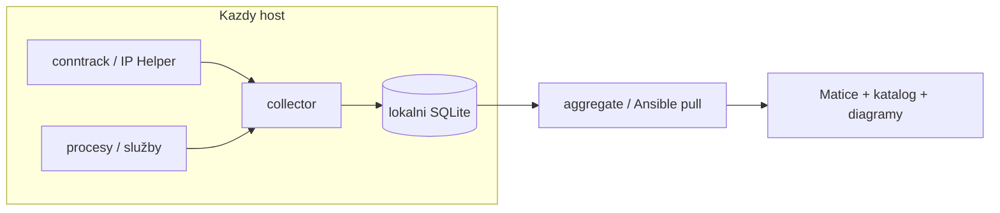

# Commatrix

> Primární README (čeština). English: [`README.en.md`](README.en.md).

Commatrix je **čistě stdlib** Python nástroj pro **Linux i Windows**, který
mapuje síťovou komunikaci přes vestavěné API operačního systému — bez odposlechu
paketů (`tcpdump`/libpcap). Na hostitelích sbírá toky, přiřazuje je k
**aplikacím/procesům**, volitelně obohacuje o **Zabbix host parametry** a skládá
**komunikační matici**, **katalog aplikací** a dokumentační exporty. Snapshoty
z Linuxu a Windows sdílejí stejné schema a sloučí se do jednoho fleet reportu.

## Tři způsoby běhu

Commatrix lze provozovat ve třech úrovních práv (zvolte jednu na hostitele):

1. **Pod uživatelem** — bez elevace. Topologie a omezená atribuce; vhodné pro
   lab a lehké inventáře.
2. **Uživatel se zvýšenými právy** — `elevate-linux` / `elevate-windows` dá
   dedicated účtu `commatrix` maximum capabilities/ACL **bez** běhu jako
   root/Administrator a **bez** otevření cesty k získání rootu (žádné sudoers,
   setuid ani členství v Administrators). Podrobnosti:
   [`docs/elevace-cs.md`](docs/elevace-cs.md)
   ([EN](docs/elevation-en.md)).
3. **Pod administrátorem / rootem** — `install.sh --as-root` nebo Windows SYSTEM
   přes `install-windows`. Plný capture včetně spolehlivého SNI, kde OS Admin
   vyžaduje.

```bash
# Linux: po ./install.sh (service účet)
sudo commatrix elevate-linux

# Windows: po install-windows (jednou jako Administrator)
python -m commatrix elevate-windows
```

Revokace (obnoví předchozí stav; při uninstall běží automaticky):

```bash
# Linux
sudo commatrix elevate-linux --revoke

# Windows (jako Administrator)
python -m commatrix elevate-windows --revoke
```

## Model capture

**Linux:** jádro už spoje sleduje. Čtení `/proc/net/nf_conntrack` (nebo
event-driven netlink) dává src/dst, port, protokol a (s accountingem) bajty.
Bez conntracku: **`sock_diag`** (jako `ss -i`), pak `/proc/net/{tcp,udp}`
(jen topologie).

**Windows:** IP Helper (`GetExtendedTcpTable`) + TCP ESTATS (best-effort bajty).
DNS-Client události, DoH posture z registru, volitelné SNI přes raw socket —
viz [Windows Server](#windows-server).

Na obou platformách se efemerní klientské porty skládají do stabilních *service
edges* s `first_seen` / `last_seen` / `max_gap`.

### Požadované Linux sysctly

```bash
sysctl -w net.netfilter.nf_conntrack_acct=1
sysctl -w net.netfilter.nf_conntrack_timestamp=1
```

(systemd unit / elevate to řeší za běhu a při stopu obnoví.)

## Požadavky

| | Linux | Windows |
|---|---|---|
| Runtime | Python 3.9+ (jen stdlib) | Python 3.9+ (stdlib; `ctypes` / `winreg`) |
| Zdroj dat | `nf_conntrack` / sock_diag / `/proc` | IP Helper + TCP ESTATS |
| Plný capture | root, nebo `elevate-linux` (caps) | Administrator / SYSTEM, nebo `elevate-windows` |
| Bez elevace | topologie (omezená atribuce) | omezená connection table |
| Volitelně | Zabbix agent | SCCM / Ansible WinRM |

## Možnosti nasazení

| Metoda | Platforma | Co dostanete | Limity |
|---|---|---|---|
| **`./install.sh`** → systemd | Linux | Collector, config, limity CPU/RAM, volitelně Zabbix | Plný capture: `--as-root` nebo `elevate-linux` |
| **`commatrix elevate-linux`** | Linux | Ambient caps + polkit DNS na účet `commatrix` | Setup jednou jako root; bez sudoers/setuid — [elevace](docs/elevace-cs.md) |
| **`packaging/install-service.sh`** | Linux | Systémová instalace + ovládání přes `commatrix-ctl` | Stejný privilege model; delegace jen pro unit |
| **`pip install .` / ze zdroje** | Linux, Windows | CLI | Bez auto-startu, dokud nepřidáte unit/task |
| **`install-windows`** | Windows | Scheduled task jako SYSTEM | Admin k instalaci; SNI potřebuje Admin |
| **`elevate-windows`** | Windows | Dedicated user + Event Log / SeDebug | Setup jednou Admin; SNI zůstává u režimu 3 — [elevace](docs/elevace-cs.md) |
| **MSI / SCCM** | Windows | Installer / fleet push | Stejné limity runtime |
| **Ansible** | Linux + Windows | Deploy, pull DB, aggregate HTML | SSH / WinRM |
| **Docker / GHCR** | Linux kontejnery | CLI + report | Live capture: privileged + host network |
| **AppImage / Snap / Flatpak** | Linux | Balíčky | Flatpak jen report/aggregate; Snap classic |
| **One-shot `collect` / `report`** | Linux, Windows | Ad-hoc matice | Mezi běhy chybí toky |

## Instalace

### Doporučeno: installer (systemd + limity)

```bash
sudo ./install.sh                 # systémově; nainstaluje a spustí službu
sudo ./install.sh --no-start
./install.sh --user               # lab (user session)
sudo ./install.sh --uninstall     # odebere (config/data nechá); revoke elevate
sudo commatrix elevate-linux      # režim 2: max bez rootu
```

### Ovládání služby jako běžný uživatel

```bash
sudo ./packaging/install-service.sh
commatrix-ctl status | start | stop | restart | logs
```

### Windows

```powershell
python -m commatrix install-windows
python -m commatrix elevate-windows   # volitelně režim 2
```

Fleet: [`ansible/`](ansible/README.md), Windows playbook
[`ansible/deploy_windows.yml`](ansible/deploy_windows.yml).

## Bezpečnost vůči hostiteli

- **CPU** ≤ ~10 % celkového výkonu (governor + systemd `CPUQuota` / Job Object)
- **Disk** ≤ ~10 % volného místa + `retention_days`
- **Paměť** strop `MemoryMax` / Job Object
- Nejnižší priorita plánovače

## Použití (stručně)

```bash
# sběr
sudo commatrix collect --config /etc/commatrix/commatrix.conf
commatrix collect --once --allow-manual --database /tmp/commatrix.db

# centralizace
commatrix export -o /var/lib/commatrix/snapshots/$(hostname).json
commatrix aggregate --central central.db --snapshot-dir snapshots/

# report
commatrix report -f html --database central.db
commatrix report -f mermaid --database central.db
```

Další: `history`, `dns`, `doh`, `time`, `diff` — viz
[`docs/pouziti-cs.md`](docs/pouziti-cs.md).

## Windows Server

Stejný princip (jen stdlib). Mapování Linux → Windows: IP Helper, ESTATS,
DNS-Client/`wevtutil`, DoH z registru, SNI přes `SIO_RCVALL` (Admin), Job Object
místo CPUQuota, `install-windows` / `elevate-windows` místo systemd.

## Architektura



## Omezení

- Polling conntrack může minout krátké toky → preferujte event mode (caps/root).
- Byte county jsou best-effort.
- SNI na Windows po `elevate-windows` **není** garantované (potřebuje Admin/SYSTEM).

## Dokumentace

- Jak to funguje: [`docs/jak-funguje-cs.md`](docs/jak-funguje-cs.md),
  [`docs/how-it-works.md`](docs/how-it-works.md)
- **Elevace práv:** [`docs/elevace-cs.md`](docs/elevace-cs.md),
  [`docs/elevation-en.md`](docs/elevation-en.md)
- Nasazení a použití: [`docs/pouziti-cs.md`](docs/pouziti-cs.md)
- SBOM: [`SBOM.md`](SBOM.md)
- Packaging / CI: [`packaging/`](packaging), [`.github/workflows/`](.github/workflows)

## Licence

GPL-3.0-or-later. Viz [LICENSE](LICENSE).
