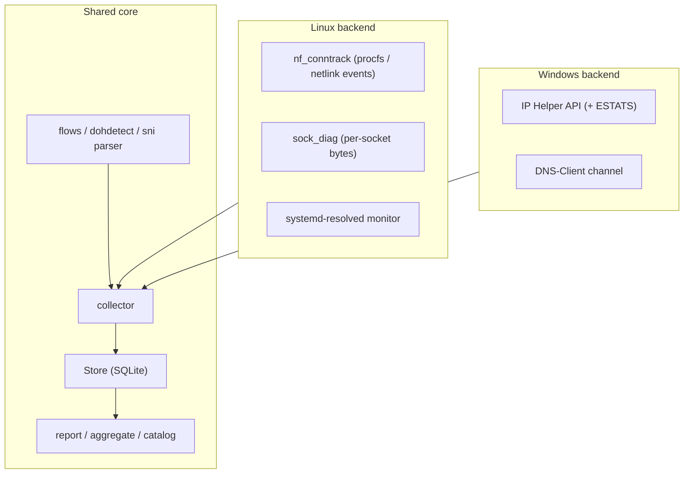

# How commatrix works (and what it does)

commatrix is a standard-library-only agent that maps **who talks to whom** on a
host, attributes each flow to the owning process/service, and aggregates the
result into a communication matrix, application catalog and security highlights
- across a whole Linux + Windows fleet, using only the OS's own facilities (no
libpcap, no third-party packages).

## Architecture

A small **platform layer** ([`commatrix/platform/`](../commatrix/platform)) hides
OS differences; the **core** is shared and platform-independent.

- Shared: `store`, `report`, `aggregate`, `catalog`, `config`, `flows`,
  `dohdetect`, the TLS ClientHello parser, SNTP, history/coverage stats.
- Linux: `conntrack`, `sockets`, `sockdiag`, `ctnetlink`, `dns` (varlink),
  `dohcheck`, `timecheck`, `netns`, `sni`.
- Windows (`platform/win`): `iphlp`, `winprocess`, `windoh`, `wintime`,
  `winsni`, `winresources`, `winetw`, `runtime`, `capture`, `runloop`.

## Capture backends and selection

commatrix never sniffs packets; it reads the kernel's connection state. The
backend is auto-selected (best available), configurable via `[capture] mode` and
`[collector] source`:

- **Linux:** `nf_conntrack` via `/proc/net/nf_conntrack` (procfs) or, for
  short-lived flows, **event-driven netlink** (`NFNLGRP_CONNTRACK_*`,
  `ctnetlink.py`) which catches flows created *and* destroyed between polls
  (DESTROY events carry final counters). Fallbacks: distro `conntrack -L` ->
  **`sock_diag`** netlink (real per-socket TCP byte counters, no install) ->
  `/proc/net/tcp` (topology only).
- **Windows:** IP Helper `GetExtendedTcpTable` (connections + owning PID); TCP
  **ESTATS** for per-connection bytes (best-effort).

## Flows, normalization and attribution

Raw connection entries are folded into stable **service edges** (ephemeral
client ports collapsed), classified as inbound/outbound/loopback and
internal/external ([`flows.py`](../commatrix/flows.py)). Each edge is attributed
to the owning process:

- Linux: socket inode -> PID via `/proc/<pid>/fd`, then process metadata
  (comm/exe/cmdline, systemd unit, container id, Kubernetes pod UID) from procfs
  cgroup; **network namespaces / containers** are enumerated via
  `/proc/<pid>/ns/net` and read through `/proc/<pid>/net/*` (root), tagging edges
  with `container_id`/`pod`/`netns`.
- Windows: owning PID comes directly from IP Helper; process path via
  `QueryFullProcessImageNameW`, service via `tasklist /svc`.

Services are named via editable signatures ([`signatures/`](../commatrix/signatures));
process signatures take precedence over port guesses.

## DNS visibility

- **DNS query log** (append-only `dns_events`): Linux from the systemd-resolved
  monitor (varlink), Windows from the DNS-Client event channel. Requires
  root/Administrator.
- **Flow enrichment:** resolved answer IPs are mapped back to the queried name,
  shown as a separate `Domain` column alongside the raw IP.
- **DoH posture** ([`dohcheck.py`](../commatrix/dohcheck.py) /
  `platform/win/windoh.py`): reports whether DNS-over-HTTPS is disabled and
  enforced (Chrome/Edge/Firefox policies, systemd-resolved DoT / Windows DoH).
- **DoH endpoint detection** ([`dohdetect.py`](../commatrix/dohdetect.py)): flows
  to known DoH/DoT resolvers are flagged (`l7=doh:<provider>`) - encrypted DNS
  bypassing the system resolver is a SOC blind-spot signal.
- **SNI capture** (opt-in): from the TLS ClientHello via AF_PACKET (Linux) or
  `SIO_RCVALL` (Windows), recovering destination hostnames even under encrypted
  DNS; Encrypted Client Hello (ECH) hides SNI (reported `<ech>`).

## Byte accounting and data quality

Byte volume trustworthiness is recorded per host (`capture.quality`):

- `exact` - conntrack accounting counters;
- `per-socket-tcp` - sock_diag TCP counters;
- `topology-only` - no byte accounting (socket tables, or accounting off).

The report surfaces this in a "Capture quality" posture section so a SOC knows
where counts are reliable.

## Storage schema (SQLite)

- `flows` - current aggregated edges (endpoints, ports, L7, bytes/packets,
  first/last seen, `max_gap`, observations, process, container/pod/netns,
  peer_domain, data_quality).
- `flow_events` - append-only IR log (`new` / `reactivated`).
- `dns_events` - append-only DNS query log.
- `runs` - collector run ledger for uptime/coverage stats.

The same schema is used locally and centrally; snapshots export/import the same
JSON contract so Linux and Windows hosts merge into one report.

## Reports and statistics

`commatrix report -f {html,markdown,csv,json,mermaid,dot,catalog,sheets,security}`.
The HTML dashboard shows: host posture (DoH, time, capture quality), summary
cards (flows, total traffic, hosts, security findings, **first run / runs /
total runtime / coverage gap %**), a collapsible communication flow grouped by
process and by address, the matrix, and security highlights (external exposure,
cleartext, encrypted DNS, missing accounting) with VirusTotal links on external
IPs. Also `commatrix history` (IR timeline), `dns`, `doh`, `time`, `diff`.

## Resource safety, service model, security

- **Resource governor** ([`resources.py`](../commatrix/resources.py)): CPU capped
  at ~10% of total compute, DB at ~10% of free disk, lowest scheduling priority;
  Windows adds a Job Object CPU/memory cap.
- **Service:** systemd unit (Linux) or a SYSTEM startup task (Windows,
  `install-windows`). On Linux it enables `nf_conntrack` accounting only for the
  run and **restores the host on exit** (crash-safe via a persisted state file).
- **Least privilege:** runs unprivileged by default (topology + per-socket bytes
  still work); full byte accounting, event capture, cross-user/namespace
  attribution and DNS logging need root/Administrator (or the documented
  capabilities). Data at rest is restricted (0640 / NTFS ACL).

## Centralization

Ansible ([`ansible/`](../ansible)) deploys the collector fleet-wide, pulls each
host's snapshot, merges them into a central DB and generates one analytical
report. Windows hosts use the same snapshot contract.

See also the usage/deployment guide: [`docs/pouziti-cs.md`](pouziti-cs.md) (CS).
