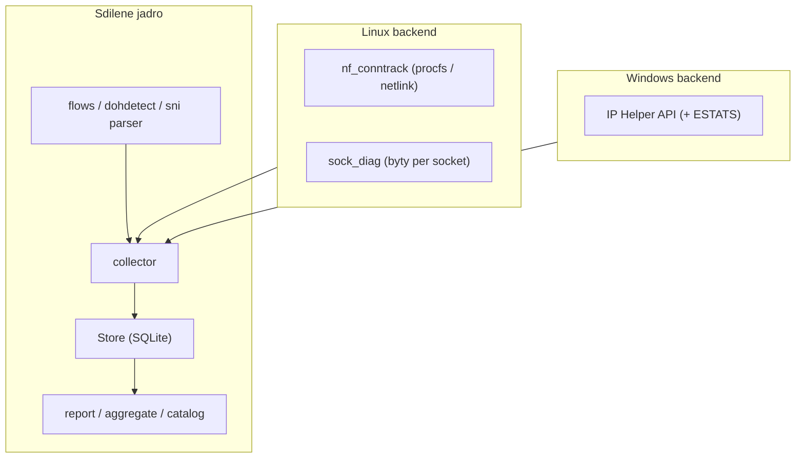

# Jak commatrix funguje (a co všechno dělá)

commatrix je agent postavený jen na standardní knihovně, který mapuje **kdo s kým
komunikuje** na stroji, přiřazuje každý tok k vlastnícímu procesu/službě a
agreguje výsledek do komunikační matice, katalogu aplikací a bezpečnostních
přehledů – napříč flotilou Linux + Windows, výhradně přes vestavěné funkce OS
(žádný libpcap, žádné třetí-strana balíčky).

## Architektura

Malá **platformní vrstva** ([`commatrix/platform/`](../commatrix/platform)) skrývá
rozdíly mezi OS; **jádro** je sdílené a nezávislé na platformě.

- Sdílené: `store`, `report`, `aggregate`, `catalog`, `config`, `flows`,
  `dohdetect`, parser TLS ClientHello, SNTP, statistiky historie/pokrytí.
- Linux: `conntrack`, `sockets`, `sockdiag`, `ctnetlink`, `dns` (varlink),
  `dohcheck`, `timecheck`, `netns`, `sni`.
- Windows (`platform/win`): `iphlp`, `winprocess`, `windoh`, `wintime`,
  `winsni`, `winresources`, `winetw`, `runtime`, `capture`, `runloop`.

## Zdroje sběru a jejich volba

commatrix nikdy neodposlouchává pakety; čte stav spojení z jádra. Backend se volí
automaticky (nejlepší dostupný), lze řídit přes `[capture] mode` a
`[collector] source`:

- **Linux:** `nf_conntrack` přes `/proc/net/nf_conntrack` (procfs), nebo pro
  krátké toky **událostmi řízený netlink** (`NFNLGRP_CONNTRACK_*`,
  `ctnetlink.py`), který zachytí i toky vzniklé a zaniklé mezi polly (DESTROY
  nese finální countery). Fallbacky: `conntrack -L` → **`sock_diag`** (reálné
  per-socket TCP byty bez instalace) → `/proc/net/tcp` (jen topologie).
- **Windows:** IP Helper `GetExtendedTcpTable` (spojení + vlastnící PID); TCP
  **ESTATS** pro byty per spojení (best-effort).

## Toky, normalizace a atribuce

Surová spojení se skládají do stabilních **service edges** (efemérní klientské
porty se sloučí), klasifikují se inbound/outbound/loopback a internal/external
([`flows.py`](../commatrix/flows.py)). Každá hrana se přiřadí k procesu:

- Linux: soket inode → PID přes `/proc/<pid>/fd`, pak metadata procesu
  (comm/exe/cmdline, systemd unit, container id, k8s pod UID) z cgroup; **network
  namespaces / kontejnery** se enumerují přes `/proc/<pid>/ns/net` a čtou přes
  `/proc/<pid>/net/*` (root), hrany se značí `container_id`/`pod`/`netns`.
- Windows: PID přímo z IP Helperu; cesta procesu přes
  `QueryFullProcessImageNameW`, služba přes `tasklist /svc`.

Služby se pojmenují přes editovatelné signatury
([`signatures/`](../commatrix/signatures)); proces má přednost před odhadem podle
portu.

## Viditelnost DNS

- **Log DNS dotazů** (append-only `dns_events`): Linux ze systemd-resolved
  monitoru (varlink), Windows z DNS-Client kanálu. Vyžaduje privileges
  (`elevate-linux` / `elevate-windows` nebo root/Administrator).
- **Obohacení toků:** odpovědní IP se mapují zpět na dotazované jméno –
  samostatný sloupec `Domain` vedle IP.
- **DoH posture** ([`dohcheck.py`](../commatrix/dohcheck.py) /
  `platform/win/windoh.py`): zda je DNS-over-HTTPS vypnuté a vynucené
  (politiky Chrome/Edge/Firefox, resolved DoT / Windows DoH).
- **Detekce DoH endpointů** ([`dohdetect.py`](../commatrix/dohdetect.py)): spojení
  na známé DoH/DoT resolvery se označí (`l7=doh:<provider>`) – šifrované DNS
  obcházející systémový resolver je SOC signál slepého místa.
- **SNI capture** (volitelné): z TLS ClientHello přes AF_PACKET (Linux) /
  `SIO_RCVALL` (Windows), získá cílové hostname i při šifrovaném DNS; ECH SNI
  skryje (`<ech>`).

## Byte accounting a kvalita dat

Důvěryhodnost objemu se ukládá per host (`capture.quality`):

- `exact` – conntrack accounting countery;
- `per-socket-tcp` – sock_diag TCP countery;
- `topology-only` – bez byte accountingu.

Report to ukazuje v sekci „Capture quality“, aby SOC věděl, kde jsou county
spolehlivé.

## Schéma úložiště (SQLite)

- `flows` – aktuální agregované hrany (endpointy, porty, L7, byty/pakety,
  first/last seen, `max_gap`, počet pozorování, proces, container/pod/netns,
  peer_domain, data_quality).
- `flow_events` – append-only IR log (`new` / `reactivated`).
- `dns_events` – append-only log DNS dotazů.
- `runs` – evidence běhů pro statistiky uptime/pokrytí.

Stejné schéma se používá lokálně i centrálně; snapshoty exportují/importují stejný
JSON kontrakt, takže Linux i Windows se slévají do jednoho reportu.

## Reporty a statistiky

`commatrix report -f {html,markdown,csv,json,mermaid,dot,catalog,sheets,security}`.
HTML dashboard: host posture (DoH, čas, kvalita sběru), souhrnné karty (toky,
objem, hosti, bezpečnostní nálezy, **první spuštění / počet běhů / celková doba /
% bílých míst**), rozklikávací komunikační flow (po procesech a adresách), matice
a bezpečnostní přehledy (externí expozice, cleartext, šifrované DNS, chybějící
county) s prokliky na VirusTotal. Dále `commatrix history`, `dns`, `doh`, `time`,
`diff`.

## Resource safety, model služby, bezpečnost

- **Resource governor** ([`resources.py`](../commatrix/resources.py)): CPU strop
  ~10 % celkového výkonu, DB ~10 % volného disku, nejnižší priorita; Windows navíc
  Job Object CPU/memory strop.
- **Služba:** systemd unit (Linux) nebo SYSTEM startup task (Windows,
  `install-windows`). Na Linuxu zapíná `nf_conntrack` accounting jen po dobu běhu
  a **při ukončení vrací hosta do původního stavu** (crash-safe přes perzistovaný
  stav).
- **Nejnižší privilegia:** ve výchozím stavu běží neprivilegovaně (topologie +
  per-socket byty fungují); plný accounting, event capture, atribuce cizích
  procesů/namespaců a DNS log vyžadují elevate (`elevate-linux` /
  `elevate-windows`) nebo root/Administrator. Viz [`elevace-cs.md`](elevace-cs.md).
  Data na disku jsou omezená (0640 / NTFS ACL).

## Centralizace

Ansible ([`ansible/`](../ansible)) nasadí collector na celou flotilu, stáhne
snapshoty, sloučí je do centrální DB a vygeneruje jeden přehled. Windows používá
stejný snapshot kontrakt.

Návod k použití a nasazení: [`docs/pouziti-cs.md`](pouziti-cs.md).
